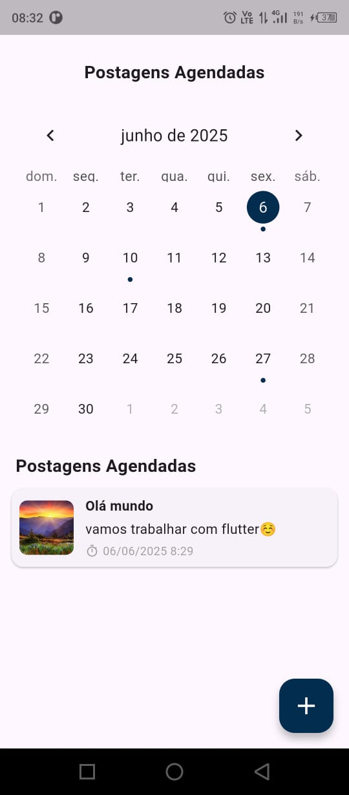
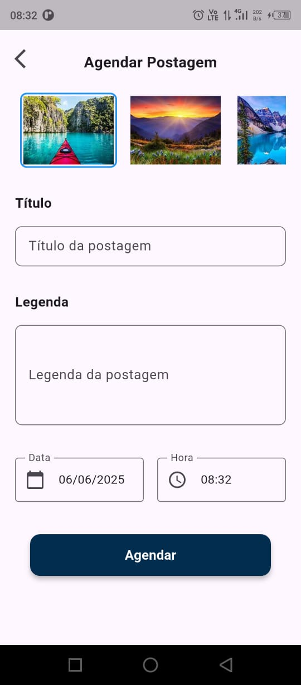

# 📱 Agendamento de Postagens

Aplicativo Flutter para agendamento de postagens com seleção de imagem, data e hora. Estrutura organizada em camadas para facilitar manutenção e escalabilidade.

---

## ✅ Funcionalidades

- Seleção de imagem para postagem
- Campo de título e legenda
- Escolha de data e hora
- Exibição de postagens agendadas por data
- Confirmação ao sair de telas
- Interface responsiva e leve

---

## 🖼️ Telas

<div style="display: flex; gap: 10px; flex-wrap: wrap;">
  
  
</div>

---

## 🗂 Estrutura de Pastas

```
lib/
├── components     # Widgets reutilizáveis
├── controllers    # Lógica da aplicação
├── models         # Estrutura de dados
├── routes         # Navegação
├── style          # Cores e temas
├── utils          # Funções utilitárias
├── views          # Telas principais
└── main.dart      # Entrada da aplicação
```

---

## ▶️ Como Rodar

1. Clone o repositório:
   ```bash
   git clone <url-do-repo>
   cd agendamento_postagens
   ```

2. Instale as dependências:
   ```bash
   flutter pub get
   ```

3. Execute o app:
   ```bash
   flutter run
   ```

---

## 🛠 Dependências principais

- `flutter`
- `go_router`
- `intl`
- `flutter_launcher_icons`

---

## 📦 Recursos adicionais

- Confirmação de saída com modal
- Ícone e nome do app personalizados
- Responsividade para diferentes tamanhos de tela

---
